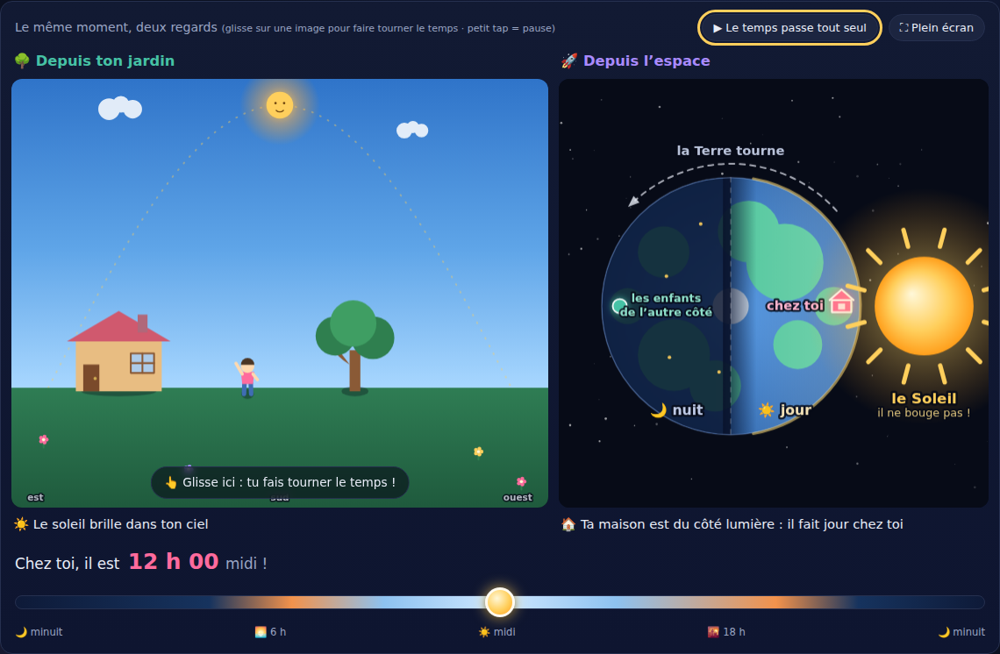
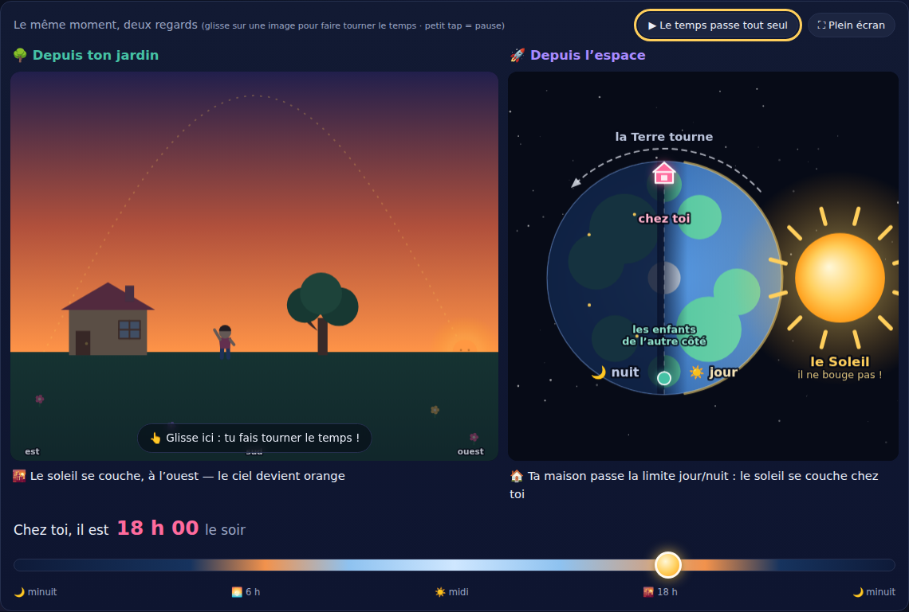
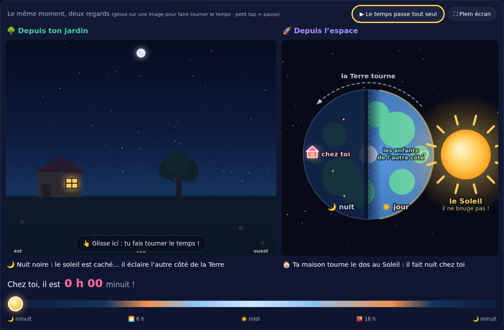
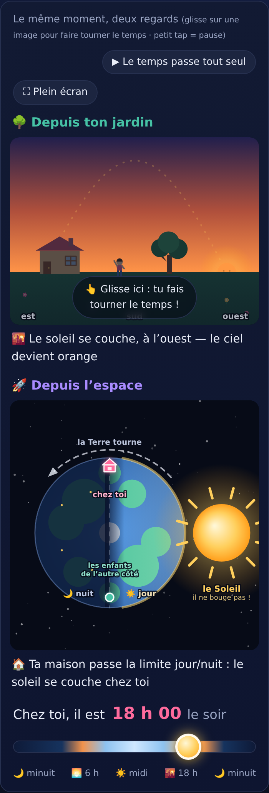

# Où va le Soleil la nuit ? 🌅

Un épisode du **Petit labo d'astronomie** : un site d'une page, interactif, pour expliquer le
lever et le coucher du soleil à une enfant de 5 ans, guidée par un parent qui lit à voix haute.

La grande révélation : **le Soleil ne va nulle part**. Il ne bouge pas, ne s'éteint pas, ne
« se couche » pas vraiment. C'est la **Terre qui tourne** sur elle-même en 24 heures ; la nuit,
c'est quand notre maison lui tourne le dos — et pendant qu'on dort, il éclaire les enfants de
l'autre côté de la Terre.

Tout le site tient dans une idée : **le même moment, vu de deux endroits.**



## Fonctionnalités

- **Deux vues synchronisées en permanence** sur la même heure :
  - **🌳 Depuis ton jardin** (canvas) : la maison, un arbre, l'enfant. Le soleil *semble*
    traverser le ciel en arc (trajectoire pointillée), se lève à l'**est** (à gauche — on
    regarde vers le sud), culmine plein **sud** à midi, se couche à l'**ouest**. Le ciel change
    en continu — nuit étoilée, **aube rose**, grand jour, **coucher orangé** — les **ombres**
    s'allongent le matin et le soir, raccourcissent à midi, toujours à l'opposé du soleil. La
    nuit : étoiles, croissant de lune à l'opposé du soleil, fenêtre allumée — et l'enfant est
    au lit.
  - **🚀 Depuis l'espace** (canvas) : la Terre vue de dessus du pôle Nord, moitié jour, moitié
    nuit. Le **Soleil est fixe sur le côté droit et ne bouge jamais** (l'acquis dur de
    l'épisode 3 : un soleil qui bouge à l'écran embrouille tout — ici, c'est même tout le
    propos !). La petite **maison rose « chez toi »** tourne avec la Terre et passe du côté
    jour au côté nuit ; sa fenêtre s'allume quand elle entre dans la nuit. En face, le marqueur
    sarcelle « **les enfants de l'autre côté** ». Flèche du sens de rotation, étiquettes
    jour/nuit, pôle Nord au centre.
- Sous chaque vue, une **petite phrase d'état** raconte le même instant deux fois (« Nuit
  noire : le soleil est caché… il éclaire l'autre côté de la Terre » / « Ta maison tourne le
  dos au Soleil ») — autour de 6 h et 18 h, la vue espace annonce le passage de la **limite
  jour/nuit**.



- **Grand curseur 0–24 h** dont la piste raconte la journée, heure affichée en gros
  (« Chez toi, il est 12 h 00 — midi ! »). Le temps passe tout seul (un tour de Terre en
  90 s) ; **pause d'un petit tap** sur une vue, bouton lecture/pause, **espace = pause**.
- **Glisser sur l'une ou l'autre vue fait tourner le temps** : sur le jardin, on suit le
  soleil du doigt (toute la largeur = la journée) ; sur l'espace, glisser **rotatif** — on
  attrape le disque et l'angle du doigt autour du centre fait tourner la Terre (un cercle du
  doigt = un tour complet, même geste que la vue du pôle de « Quelle heure est-il là-bas ? »).
- **Quatre boutons-scénarios** : 🌅 *Le soleil se lève* (6 h), ☀️ *Midi pile* (12 h), 🌇 *Le
  soleil se couche* (18 h), 🌙 *Minuit, tu dors* (0 h). Le temps glisse en douceur — **toujours
  vers l'avant, le vrai sens de la Terre** — puis une micro-histoire raconte le même instant
  **depuis le jardin puis depuis l'espace** (« Le voilà ! Ta maison lui tourne le dos, tout
  simplement… »). Comme dans l'épisode 3, le jeu existe **avec ou sans la voix** : le bouton
  🔇/🔊 à côté du titre active la version sonore — le conteur dit « Dans ton jardin… », puis
  « Et maintenant, vu de l'espace… » — et le choix est retenu d'une visite (et d'un épisode)
  à l'autre.



- **Le jeu « 🌍 Fais tourner la Terre ! »**, après la révélation : le site demande un moment
  de la journée (🌅 fais lever le soleil, ☀️ midi pile, 🌇 couche le soleil… et le défi-vedette
  ⭐ *fais briller le grand jour chez les enfants de l'autre côté* — il faut plonger sa propre
  maison dans la nuit !), et l'enfant le **fabrique** en faisant tourner le temps du doigt sur
  deux mini-vues répliquées (jardin + espace, toujours synchronisées sur la même heure — la
  vue espace en version « pure image », sans étiquettes). Fenêtre de réussite ±45 min (large,
  pour des doigts de 5 ans), petite tempo anti « gagné en passant », « ⭐ Bravo ! » raconté
  sur les deux regards, bouton « Encore une ! ». À la victoire, **recalage doux** de l'heure
  pile sur le moment (annulé par tout glisser — rien n'est jamais verrouillé), et le **bravo
  ne ment jamais** : si on remporte la Terre ailleurs, il se range (avec une fenêtre de sortie
  ±1 h 15, pour ne pas clignoter au bord) et revient quand on re-fabrique le moment. Le conteur (bouton 🔇/🔊) lit
  consignes et bravos ; les défis vivent dans le modèle pur et sont testés (tous atteignables,
  fenêtres jamais chevauchées).
- **La boîte « Le Soleil ne va nulle part ! »** : la grande révélation en cinq petits
  paragraphes à lire à voix haute, qui se referment sur le refrain de la série — *… parce que
  la Terre tourne !* — à lire… ou à **écouter**.
- **La voix du conteur est enregistrée** (fabriquée une fois pour toutes avec ElevenLabs,
  mp3 commités dans `assets/audio/`) : elle raconte la grande histoire, les scénarios et les
  défis du jeu, avec de vraies pauses entre les blocs. Le site ne joue un fichier que si son
  texte correspond encore au texte affiché — sinon, **repli** sur la synthèse vocale du
  navigateur (la plus naturelle des voix françaises de l'appareil, menu pour en changer,
  choix partagé entre les épisodes). Rien ne part sur Internet pendant la lecture. Le guide
  de production : [`docs/voix-conteur.md`](docs/voix-conteur.md).
- **Le pont vers l'épisode 3** : « Et si le soleil se couche chez toi… il se lève chez qui ? »
  → [Quelle heure est-il là-bas ?](https://davidb-prog.github.io/la-terre-tourne/)
- **Mise en page mobile dédiée** : sous 640 px les vues s'empilent, plafonnées en hauteur
  d'écran pour tenir ensemble dans le viewport, rien ne recouvre jamais les canvas, l'en-tête
  se fait tout petit (le jardin se voit dès le premier écran), les boutons font au moins 44 px.
  Le geste posé sur une vue appartient toujours au glisser du temps (`touch-action: none`,
  comme « Pourquoi la Lune change de forme ? ») — un doigt un peu de travers ne part jamais
  en défilement, et les vues plafonnées laissent de la page autour pour défiler. La grande
  histoire se replie derrière son titre (comme la note aux parents). Appuyer sur un scénario
  ramène doucement les vues à l'écran. En pause, plus aucun redessin (batterie).
- Accessible : aria-labels descriptifs sur les deux canvas, `prefers-reduced-motion` respecté
  (rien ne bouge tout seul, les scénarios sautent sans animation), curseur au clavier.



## Lancer en local

Aucune dépendance, aucun build. Il faut juste un petit serveur statique
(les modules ES ne se chargent pas depuis `file://`) :

```bash
python3 -m http.server 8000
# ou : npx serve
```

puis ouvrir <http://localhost:8000>.

## Tests

Le modèle (soleil, ombres, rotation, ciel, scénarios) est pur — aucun accès DOM — et se teste
sous Node, sans navigateur :

```bash
node test/model.test.mjs
node test/voix.test.mjs
```

**67 vérifications**, dont les vérités du récit : le Soleil est **fixe** (sa direction à
l'écran ne change jamais) ; la Terre avance de 15° par heure, **vers l'est**, un tour en
24 h ; lever à 6 h à l'**est**, zénith à midi plein **sud**, coucher à 18 h à l'**ouest**
(hauteur = sin(π·(h−6)/12), la formule de l'épisode 3) ; les **ombres** longues matin et soir,
courtes à midi, toujours à l'opposé du soleil, absentes la nuit ; **les deux vues racontent la
même chose** (maison côté jour du globe ⟺ soleil levé au jardin) ; à **minuit chez nous, le
soleil est au zénith de l'antipode** ; le **ciel est continu** sur 24 h (aucun saut de
couleur), rose à l'aube, orangé au coucher ; les **défis du jeu** sont tous atteignables,
à des heures toutes différentes, et leurs fenêtres (±30 min) ne se chevauchent jamais.

Le site est aussi vérifié en navigateur (Playwright/Chromium, desktop + mobile 390 px) :
zéro erreur console, sondes de pixels sur la géométrie jour/nuit du disque terrestre, la place
du Soleil (identique à midi et à minuit !), les couleurs du ciel et la direction des ombres,
glissers sur les deux vues, tap-pause, scénarios (toujours vers l'avant), le jeu complet
(défi raté hors fenêtre, gagné dans la fenêtre après la tempo, « Encore une ! », glisser sur
les mini-vues), `prefers-reduced-motion`, captures d'écran
examinées aux heures clés.

## Déployer sur GitHub Pages

Le workflow `.github/workflows/deploy-pages.yml` publie le site à chaque push sur `main`.
Dans les réglages du repo : **Settings → Pages → Source : « GitHub Actions »**
(le workflow tente aussi de l'activer automatiquement au premier run).

## Le modèle

Tout est dans [`js/model.js`](js/model.js) (aucun accès DOM, toutes les constantes) :

- **L'heure du site est l'heure solaire** d'un jour d'équinoxe : lever 6 h, coucher 18 h,
  hauteur du soleil = sin(π·(h−6)/12) — les mêmes conventions que l'épisode 3, qui raconte
  la suite (heure légale et fuseaux).
- **La vue espace** reprend l'angle de l'épisode 3 : maison à `(h−12)/24·τ`, sens
  trigonométrique vue du pôle Nord (= vers l'est), 0 = face au Soleil à midi. Le Soleil est
  une **constante** (`SUN_DIR`), pas une variable : il ne peut pas bouger.
- **Les ombres** : élévation simplifiée 45°·hauteur (équinoxe vers 45° de latitude — la
  France), longueur = cotangente plafonnée à 6 hauteurs d'objet, direction = l'opposé exact
  du soleil.
- **Le ciel** : quatre palettes-jalons (nuit, aube rose, jour, coucher orangé) interpolées
  en douceur le long de la journée — la continuité est testée.

## Ce que le site simplifie

- **L'heure du jardin est l'heure solaire.** Midi = soleil au plus haut, plein sud. L'heure
  légale des montres (la France vit en avance sur son soleil, jusqu'à 2 h en été) et les
  fuseaux horaires sont le sujet de l'épisode 3.
- **Un éternel jour d'équinoxe** : lever 6 h, coucher 18 h, jour = nuit = 12 h, partout. En
  vrai, ça dépend de la saison (l'axe penché de la Terre) et de la latitude.
- **Hémisphère nord** : la vue jardin regarde vers le sud (est à gauche, ouest à droite, le
  soleil culmine au sud). Dans l'hémisphère sud, c'est le miroir.
- **Les ombres à midi** pointent en vrai vers le nord (derrière les objets dans notre vue de
  face) : le site les montre toutes petites « cachées sous les pieds ». Longueur plafonnée à
  6 hauteurs d'objet près du lever/coucher (sinon elle serait infinie) ; à 6 h et 18 h pile,
  l'ombre géante est encore dessinée, pleine encre — elle ne s'évanouit que pendant que le
  disque plonge sous l'horizon (l'image du scénario « coucher » garde ainsi ses ombres
  étirées, comme le raconte la voix).
- **La lune est un croissant-pictogramme**, pile à l'opposé du soleil (levée à 18 h, zénith à
  minuit) : la silhouette de croissant garantit qu'aucun enfant ne la prend pour le soleil.
  Double licence : à l'opposé du soleil, une vraie lune serait *pleine* — et un vrai croissant
  ne monte jamais au zénith à minuit (il reste près du soleil). En vrai, phase et heure de
  lever changent chaque jour — c'est l'épisode 1.
- **La vue de l'espace** : Terre vue de dessus du pôle Nord, continents stylisés, tailles et
  distances pas à l'échelle (le Soleil est 109 fois plus large que la Terre et 11 700 fois
  plus loin). La limite jour/nuit est franche, avec un petit dégradé de crépuscule.
- **Pas d'atmosphère** : ni réfraction (qui allonge un peu les journées réelles), ni
  crépuscules qui traînent — le ciel du site suit simplement la hauteur du soleil.
- **La voix de lecture** est celle de l'appareil (rien ne part sur Internet) : sa qualité varie
  beaucoup. Le site note les voix françaises disponibles et prend la plus naturelle ; sur
  Chrome ou Edge, ou avec une voix « améliorée » téléchargée, la lecture devient vraiment
  douce. Le choix de voix est partagé avec l'épisode 3 (même origine GitHub Pages).

## Structure

```
index.html            page unique (deux vues synchronisées, curseur 0–24 h, scénarios,
                      révélation, jeu « Fais tourner la Terre ! », pont vers l'épisode 3,
                      note aux parents)
css/style.css         thème sombre de la série, responsive (bascule mobile ≤ 640 px), aucune lib
js/model.js           modèle pur (soleil, ombres, rotation, ciel, scénarios, défis du jeu) —
                      testable sous Node
js/canvas.js          helpers canvas partagés (fitCanvas, étoiles, étiquettes à halo)
js/garden.js          vue jardin (ciel continu, arc du soleil, lune, ombres, décor)
js/space.js           vue espace (Soleil FIXE à droite, Terre vue du pôle Nord, marqueurs ;
                      mode « mini » sans étiquettes pour le jeu)
js/main.js            boucle d'animation + interactions (curseur, glissers, tap-pause,
                      scénarios et leur version sonore, jeu, conteur — voix enregistrée
                      si disponible, synthèse du navigateur en repli)
test/model.test.mjs   tests Node du modèle (67 vérifications)
test/voix.test.mjs    corpus vocal + cohérence des fichiers enregistrés avec les textes
tools/voix-lib.mjs    corpus des blocs parlés (la seule partie propre à cet épisode)
tools/build-voix.mjs  génération des mp3 du conteur avec ElevenLabs (hors site)
assets/audio/         manifest.json + les mp3 du conteur
```

## La série

- 🌒 [La mécanique des éclipses](https://davidb-prog.github.io/eclipse-explorer/) — les deux
  coïncidences qui fabriquent une éclipse.
- 🌅 **Où va le Soleil la nuit ?** (ce site) — le Soleil ne bouge pas : c'est la Terre qui
  tourne, et la nuit c'est quand ta maison lui tourne le dos.
- 🌍 [Quelle heure est-il là-bas ?](https://davidb-prog.github.io/la-terre-tourne/) — la
  Terre tourne, et il n'est pas la même heure partout.
- 🌙 [Pourquoi la Lune change de forme ?](https://davidb-prog.github.io/la-lune-change-de-forme/) —
  la Lune est toujours à moitié éclairée ; c'est nous qui la voyons d'un côté différent
  chaque nuit.
